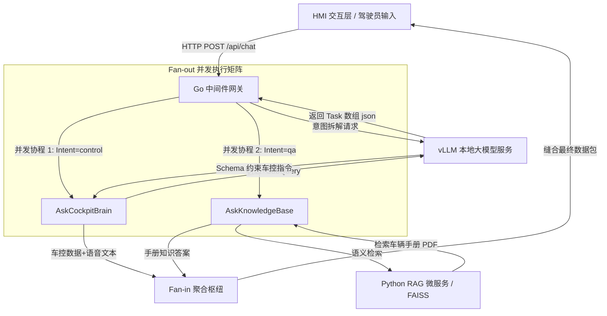
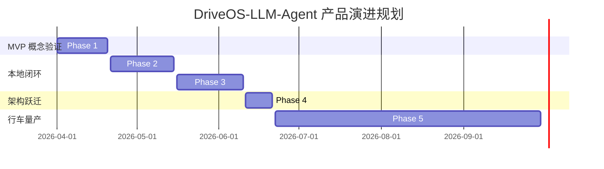

# DriveOS-LLM-Agent 智能座舱大模型 Agent（车载智能助手）产品需求文档 (PRD)

- **产品名称：** DriveOS 智能座舱大模型 Agent
- **文档版本：** v1.0.0
- **当前状态：** 草案 (Draft)
- **文档作者：** DriveOS 智能座舱产品经理
- **创建日期：** 2026-06-21
- **目标受众：** 智能座舱开发团队、车载 OS 研发团队、AI 算法工程师、测试工程师

---

## 1. 产品概述

### 1.1 业务背景与痛点
随着汽车智能化转型的深入，智能座舱已成为各大车企差异化竞争的核心卖点。
然而，现有的车载语音助手（NLU 时代产品）在实际使用中存在三大行业痛点：
1. **混合意图发散：** 用户习惯以自然的非结构化口语表达复合指令（例如：
   “我有点冷，顺便帮我查一下怎么开儿童锁”）。传统语音助手无法同时解析
   “车控调节”与“手册查询”两种异观的意图，导致无法响应或执行错误。
2. **单线程顺序响应延迟：** 当面对复杂任务时，传统网关或 Agent 采用单线程
   顺序执行（串行调用 AI 推理与检索），导致端到端响应延迟极高（常大于 3 秒），
   严重降低驾驶员的即时交互体验。
3. **缺乏车控执行边界与安全防御（Schema Drift）：** 直接使用商业云端大模型
   生成车控报文，容易出现幻觉，输出格式不规范（如生成多余的解释文字），
   且极度依赖外部网络，存在安全隐患与不可控的隐私泄露风险。

### 1.2 产品定位与核心价值
本产品（DriveOS-LLM-Agent）是一款**面向车载边缘端部署的、低延迟、高可靠
多意图并发协同的智能座舱 Agent 系统**。
本系统的核心价值在于：
* **去云端依赖的纯本地化：** 采用本地微调大模型与本地向量数据库，提供 100%
  离线运行能力，保障用户数据隐私与弱网情况下的高可用性。
* **高并发极速响应：** 引入 Go 语言构建的并发网关，通过 Fan-out/Fan-in
  并发矩阵，实现多意图的并行处理，端到端延迟控制在 1.5 秒以内。
* **硬件控制强契约约束：** 通过 JSON Schema 对大模型输出进行强类型约束，
  确保硬件控制报文的准确率达到 99.9% 以上，完美兼容下游 CAN 信号总线解析。

---

## 2. 目标用户与典型使用场景

### 2.1 目标用户画像
* **科技尝鲜型驾驶员：** 对智能设备要求高，期望车机能像真人助手一样进行
  自然的、复杂的语音交互，习惯在行车过程中通过口语化短句发布多重指令。
* **新手或非技术型车主：** 对车辆功能不熟悉（如不懂仪表盘故障灯含义、不知道
  如何配置车机功能），需要频繁查询长达数十万字的《车辆用户手册》。
* **家庭出行舱乘员：** 乘客在副驾或后排发起空调、多媒体等控制请求，需要
  助手在几毫秒内准确响应，避免反复唤醒。

### 2.2 典型用户场景 (User Journeys)

#### 场景一：混合异构意图并发（车控 + RAG 问答）
* **用户输入：** “车里太闷了，把窗户开个缝，另外这车的自动泊车怎么用？”
* **产品行为：** 
  1. 意图解剖中枢将指令拆解为 `[车控: 开窗缝]` 与 `[知识问答: 自动泊车使用方法]`。
  2. 网关并发分发，一条链路生成车窗控制 JSON 流，另一条链路在本地车辆手册中检索
     自动泊车的使用步骤。
  3. 缝合回复：车窗自动降下 10%，车机语音播报：“已为您开窗通风。关于自动泊车，您需要
     按下中控台的 P 键……”

#### 场景二：Context-Aware 动态决策（状态感知车控）
* **用户输入：** “把温度调低一点”
* **产品行为：**
  1. 助手自动读取当前车载传感器状态（当前室温: 26℃）。
  2. 助手智能决策，将空调目标温度下调至 24℃，而不是盲目设置固定低温。
  3. 下发空调控制指令并将决策以拟人化的口吻播报给用户。

---

## 3. 系统架构与业务逻辑

### 3.1 产品逻辑架构图



### 3.2 核心业务流说明
1. **意图解剖 (Fan-out 准备)：** 协同网关接收用户输入，首先向本地大模型
   （配置为 `temperature: 0.0`）发送意图解剖请求，通过强 Schema 约束将输入
   拆解为独立的 `intent` 任务列表。
2. **多路并发分发：** 网关使用 Go 协程（Goroutine）并行启动多个子任务。
   * 对于 `control` 任务：携带当前车辆状态调用大模型生成具体 JSON 控制流。
   * 对于 `qa` 任务：调用本地 RAG 服务的检索接口获取手册相关答案。
3. **屏障等待与缝合 (Fan-in)：** 网关利用同步原语等待所有并行链路返回，
   加锁合并文本回复与硬件控制流，最后将统一包发送回 HMI。

---

## 4. 功能需求详情 (Functional Requirements)

### 4.1 意图解剖与路由中枢 (FR-01)
* **需求描述：** 系统必须能够精准分析用户输入的混合短语，剥离为具体的原子子任务。
* **业务逻辑与规则：**
  * 意图分类标准：
    * `control`：涉及空调、车窗、多媒体、座椅、后备箱等所有物理硬件控制意图。
    * `qa`：涉及车辆故障、仪表盘警告图标、日常保养规范、配置手册等咨询问答意图。
  * 架构要求：必须采用强类型 JSON Schema 强迫 LLM 输出满足以下定义：
    ```json
    {
      "tasks": [
        {
          "intent": "control",
          "sub_query": "把温度调低一点"
        },
        {
          "intent": "qa",
          "sub_query": "这台车的安全气囊在什么位置？"
        }
      ]
    }
    ```
* **容错降级：** 若大模型解析失败或网络超时，系统必须自动触发降级，将整个
  原始 Query 划为 `control` 意图发送，进入防死锁兜底机制。

### 4.2 强契约硬件控制生成 (FR-02)
* **需求描述：** 将用户的控制意图转换为车辆下游 ECU 可执行的结构化报文。
* **业务逻辑与规则：**
  * 接口契约规范：大模型在返回控制回复时，必须输出严格符合如下 JSON Schema
    规范的格式，禁止输出多余的解释性文本或格式不符的标点。
    ```json
    {
      "reply": "好的，已为您将空调温度调低至 24 度。",
      "control": [
        {
          "device": "hvac",
          "action": "set_temperature",
          "value": 24.0
        }
      ]
    }
    ```
  * 支持控制的设备集：
    * 空调 (`hvac`)：制冷、制热、温度设置、风量大小、内外循环。
    * 车窗与天窗 (`window` / `sunroof`)：打开、关闭、开缝、百分比控制。
    * 媒体与音量 (`media` / `volume`)：播放、暂停、下一首、音量加减。
  * **安全红线限制：**
    > [!IMPORTANT]
    > 严禁通过大模型生成危及行车安全的控制指令（如：高速行驶时开启车门、
    > 挂入倒挡等）。系统后级中间件必须设置物理安全白名单，过滤非法指令。

### 4.3 本地 RAG 车载说明书问答 (FR-03)
* **需求描述：** 驾驶员及乘员可通过语音随时调阅《用户使用手册》，解答用车疑问。
* **业务逻辑与规则：**
  * 数据离线建库：后台离线解析整本《车辆使用手册》PDF，按语义段落进行切分
    （每段不超过 500 字，重叠 50 字），通过 `bge-large-zh-v1.5` 模型转化为
    向量，存入本地 FAISS 数据库。
  * 语义检索过滤：在线收到 `qa` 任务后，RAG 微服务将 `sub_query` 转化为向量，
    检索 Top 3 最相关知识片段，计算相似度 Score。
  * 答案合成限制：大模型回答必须强依赖检索到的手册片段，如果手册未提及相关内容，
    系统应回答“抱歉，在车辆说明书中未找到相关信息，建议您咨询售后”。避免大模型
    基于自身幻觉编造虚假参数。

### 4.4 状态感知决策机制 (FR-04)
* **需求描述：** 智能助手必须能够动态感知当前车身传感器数据，并在此上下文上进行决策。
* **业务逻辑与规则：**
  * 触发机制：每次发起 `control` 指令时，Go 网关必须将当前车身快照
    （如 `{"空调温度": 25, "车窗": "关闭"}`）注入大模型 System Prompt 中。
  * 示例逻辑：
    * 用户输入：“车窗开大点” + 车辆状态：“当前车窗半开” -> 动作：“把车窗完全打开”。
    * 用户输入：“空调太冷了” + 车辆状态：“当前空调温度 20℃” -> 动作：“空调温度设为 23℃”。

---

## 5. 非功能性需求 (Non-Functional Requirements)

### 5.1 性能与响应时延指标 (Latency Budget)
智能车机对实时性要求极高，系统整体端到端时延（从点击发送到 HMI 收到响应）
目标必须满足以下要求：

| 阶段 | 模块 / 操作 | 目标时延 (P95) | 极限容忍时延 |
| :--- | :--- | :--- | :--- |
| 第一阶段 | 意图解剖 (LLM Routing) | ≤ 300ms | 500ms |
| 第二阶段 | 并发分支 1: RAG 向量检索与答案生成 | ≤ 800ms | 1200ms |
| 第二阶段 | 并发分支 2: 车控 JSON 序列化生成 | ≤ 600ms | 1000ms |
| 第三阶段 | 缝合与网关返回 (Fan-in) | ≤ 10ms | 30ms |
| **全链路**| **端到端 HMI 响应时间** | **≤ 1200ms** | **1500ms** |

> [!TIP]
> 针对 RAG 生成的长文本回答，为避免界面卡死，车机 HMI 端应支持**文本流式输出 (Streaming)**，
> 但控制指令 (JSON) 必须一次性完整包下发，防止指令发生部分截断而导致硬件无法执行。

### 5.2 鲁棒性与异常防御
1. **Schema Drift 防御率 100%：** 必须使用大模型推理框架（如 vLLM 或 llama.cpp）
   的 JSON Mode / Guided Decoding 选项，强制让模型采样符合语法规范的 JSON，
   阻断任何非 JSON 字符串输出，防止下游 Go 解析崩溃。
2. **边缘降级机制：** 当发生本地微服务超时（超过 1.5 秒无应答），Go 网关须
   自动向前端发送兜底文字提示（“座舱助手正忙，请稍后再试”）并记录 Error 日志。
3. **低资源消耗：** 在车端计算单元（如高通 8155 或 8295 芯片）部署时，
   智能体推理后台内存占用需控制在 12GB 以下，不能挤占仪表盘与核心车控系统资源。

---

## 6. 产品路标与迭代规划 (Roadmap)



* **Phase 1 (已完成)：** 搭建 Go 协同网关与 Python 后端，接入商业 API，验证“多任务路由”逻辑可行性。
* **Phase 2 (已完成)：** 摆脱商业大模型依赖，使用开源 Qwen-7B 引入车控领域 SFT 数据微调，本地部署 vLLM。
* **Phase 3 (已完成)：** 构建包含向量库 FAISS 的 RAG 微服务，解决本地 PDF 用户手册检索，攻克幻觉难题。
* **Phase 4 (已完成)：** 针对混合指令响应慢的问题，重构 Go 协同网关为 Fan-out 并发网关，全链路延迟大幅下降。
* **Phase 5 (规划中/即将启动)：** 开展软硬件联调。接入车载 ASR/TTS 引擎，设置硬件安全物理屏障，适配车规级 CAN/LIN 总线。

---

## 7. 开放性讨论与展望
1. **ASR 与大模型一体化：** 未来是否可将 ASR（语音识别）直接与 LLM 音频端到端打通，
   由模型直接接收音频流，从而大幅削减 ASR 转换文本带来的信息损失与语义偏差？
2. **多模态感知：** 引入座舱内摄像头数据（如驾驶员视线、疲劳状态、手势），
   使 Agent 能够结合“视觉 + 语音”做出更主动、千人千面的智能服务决策。
